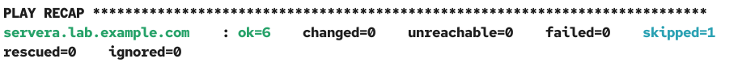

# Ansible Playbook Control

Ansible playbook demonstrating core control flow concepts.

## What This Covers
- **loop**: iterate over lists and dictionaries
- **when**: conditional task execution based on facts
- **block/rescue**: error handling (try/catch)
- **handler**: trigger service restart only when config changes
- **vars_files**: separate variables from logic

## What It Does
Deploys a HTTPS web server on Rocky Linux:
1. Pre-flight check (RAM and OS validation)
2. Install httpd + mod_ssl
3. Start and enable services
4. Configure SSL certificates
5. Open firewall ports (http/https)

## Requirements
- Rocky Linux
- Minimum 256MB RAM
- Ansible 2.9+

## Usage
```bash
ansible-playbook playbook.yml
## Execution Result



